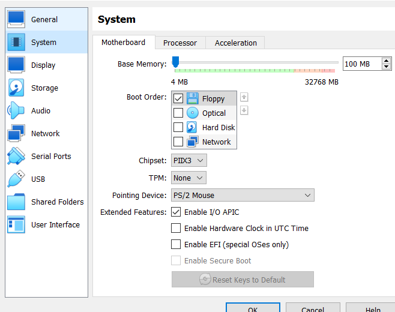
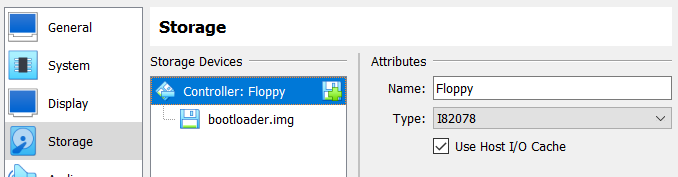

### Simple bootloader

1. Build Docker image from Dockerfile
`docker build -t boot2 .`

2. Run the image
`docker run -it boot2`

3. Using Docker Desktop download file `/usr/src/bootloader/bootloader.img`

4. Run Oracle VM VirtualBox add a new image with the following parameters:

System -> Motherboard -> Boot Order  = (only) Floppy

Storage -> Storage Devices Controller Floppy with 'bootloader.img'

5. Start VirtualBox image
